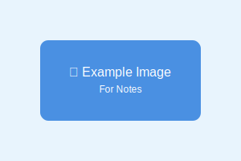

🎉 Notes now support optimized images! You can include pictures using Astro's Image component for better performance, including HEIC files from your iPhone.



Use Astro's optimized image processing by storing images in `/src/notes/images/` and referencing them with relative paths in markdown.

## Featured Images

You can also set a `featuredImage` in the frontmatter to display an image prominently at the top of your note. Images from iPhone (including HEIC format) are fully supported:

```yaml
---
featuredImage: ./example-photo-iphone.jpg
---
```

The featured image should be stored in the same directory as your note content (e.g., `/src/content/notes/`) for content collection images, or use relative paths to images in `/src/notes/images/` for markdown content. 

**HEIC Support**: HEIC files from iPhone are supported through the underlying Sharp image processing library. For featured images in content collections, you may need to convert HEIC files to JPG/PNG format, but HEIC files work seamlessly in markdown content.