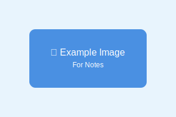

🎉 Notes now support optimized images! You can include pictures using Astro's Image component for better performance.



Use Astro's optimized image processing by storing images in `/src/assets/images/notes/` and referencing them with relative paths in markdown.

## Featured Images

You can also set a `featuredImage` in the frontmatter to display an image prominently at the top of your note:

```yaml
---
featuredImage: ./example-image.svg
---
```

The featured image should be stored in the same directory as your note or use a relative path to the image in your assets folder.